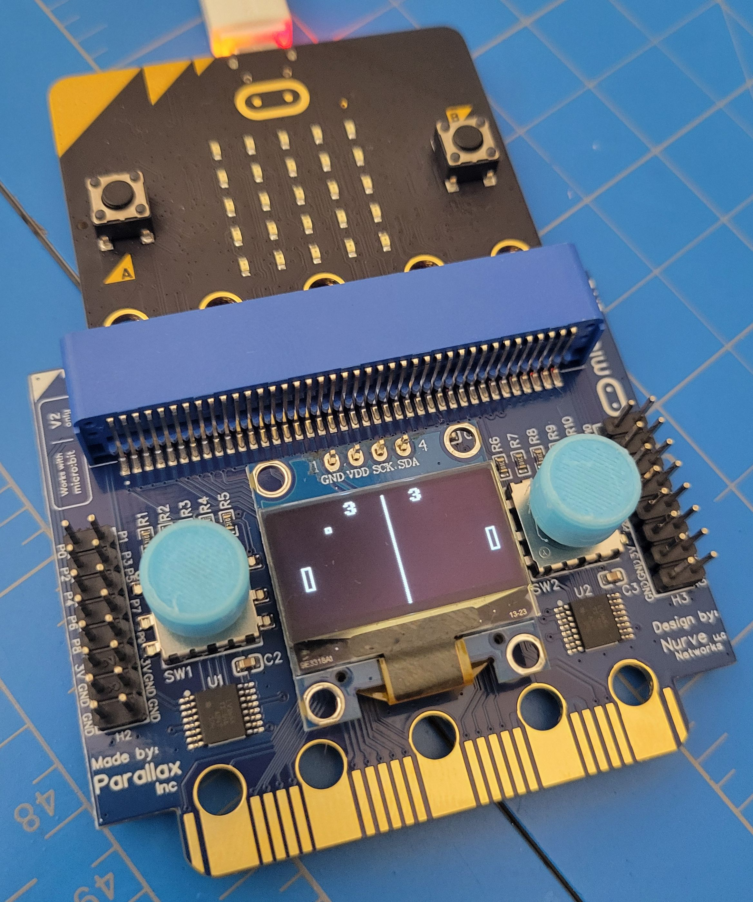
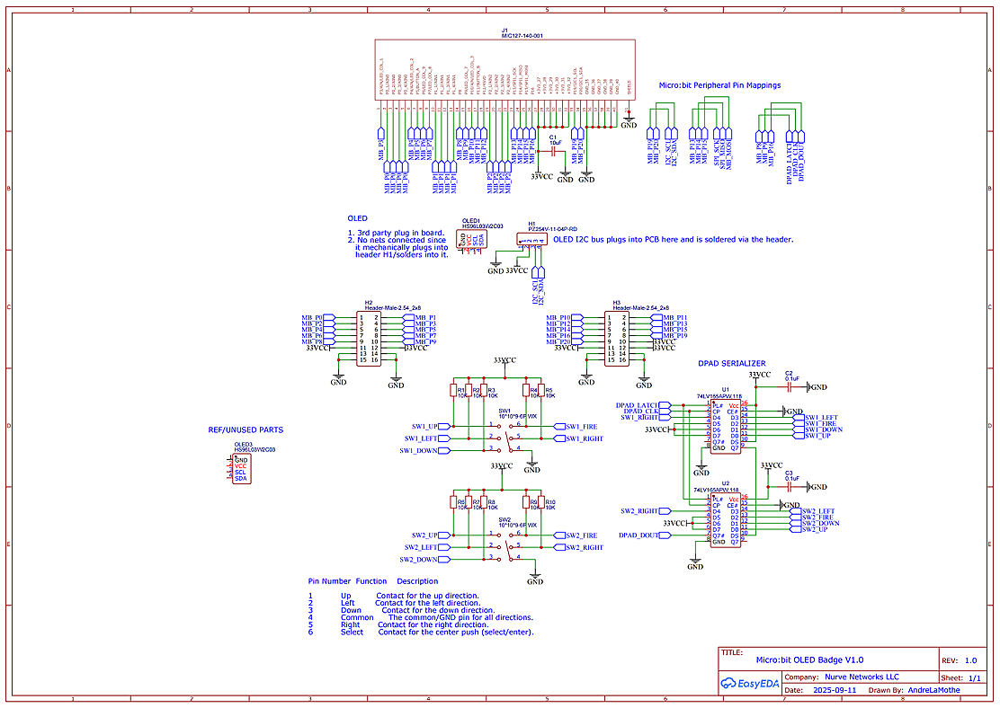

<h1>Micro:bit OLED Badge / Gaming Adapter</h1>

  <strong>Advanced 128x64 OLED Display & Dual Serialized 5-Way Joysticks for BBC Micro:bit (v1 & v2)</strong>

  

Welcome to the official repository for the <strong>Micro:bit Electronic Badge</strong>, engineered by <strong>Nurve Networks LLC</strong>. This hardware expansion board transforms your BBC micro:bit into a fully self-contained portable gaming console, interactive wearable badge, or data-monitoring dashboard. By leveraging high-efficiency parallel-to-serial shift registers, the badge provides an expansive 10-button input control map while preserving critical micro:bit GPIO resources for your own prototyping needs.

  <strong>🛒 Get the Hardware:</strong> Ready to build your own wearable projects or retro games? You can purchase the production-ready Micro:bit OLED Badge directly on Amazon here: <a href="YOUR_AMAZON_LISTING_LINK" target="_blank" style="color: #007791; font-weight: bold; text-decoration: underline;">Buy on Amazon</a>

<h2>📸 Hardware Architecture at a Glance</h2>

  

<ul>
  <li><strong>Processor Compatibility:</strong> Plugs directly into any standard BBC micro:bit v1 or v2 via the top 40-pin card-edge interface (J1).</li>
  <li><strong>High-Contrast Display:</strong> Integrated 128x64 pixel monochrome bitmapped OLED breakout module powered by the industry-standard SSD1306/1315 controller.</li>
  <li><strong>Dual 5-Way Tactical Controls:</strong> Two serialized joysticks (SW1 and SW2) located on either side of the display providing independent Up, Down, Left, Right, and center Click/Fire buttons (10 inputs total).</li>
  <li><strong>Infinite Expansion:</strong> Dual 2x8 0.1-inch pitch breakout headers (H2 and H3) export all micro:bit GPIOs alongside dedicated system power and ground rails.</li>
  <li><strong>Daisy-Chaining Support:</strong> Features a duplicate micro:bit "clone" edge connector at the base of the PCB, allowing you to pass all system lines through to secondary expansion accessories or breadboard breakout adapters.</li>
</ul>

<h2>📐 Technical Specifications</h2>

<table width="100%">
  <thead>
    <tr style="background-color: #f4f6f8;">
      <th align="left">Specification Parameter</th>
      <th align="left">Details / Operational Limits</th>
    </tr>
  </thead>
  <tbody>
    <tr>
      <td><strong>Operating Voltage</strong></td>
      <td>3.3V DC (Derived directly from the micro:bit host supply bus).</td>
    </tr>
    <tr>
      <td><strong>Current Consumption</strong></td>
      <td>1 mA to 25 mA dynamic load (dependent on active OLED pixel ratio); &lt;1 µA when OLED is placed into deep sleep mode.</td>
    </tr>
    <tr>
      <td><strong>Display Communication Protocol</strong></td>
      <td>I2C Serial Bus (Hardware Address: <code>0x3C</code>, or <code>0x3D</code> on alternate displays).</td>
    </tr>
    <tr>
      <td><strong>I2C Speed Architecture</strong></td>
      <td>Supports Standard Mode (100 kbits/s) and Fast Mode (400 kbits/s).</td>
    </tr>
    <tr>
      <td><strong>Operating Temperature Profile</strong></td>
      <td>Industrial grade: -4°F to +185°F (-40°C to +85°C).</td>
    </tr>
    <tr>
      <td><strong>Mechanical Dimensions</strong></td>
      <td>66.9 mm x 58.9 mm (2.64 in x 2.31 in) inclusive of base edge footprint.</td>
    </tr>
  </tbody>
</table>

<h2>📁 Repository Directory Structure & Demos</h2>

This repository provides a comprehensive pipeline of driver libraries and pre-compiled software configurations to get you prototyping immediately:

<ul>
  <li>📁 <code>/Demos</code> - This contains all the source code for the product; demos, games, drivers and tools. 
  </li>
  <li>📁  <code>ProgrammersGuideDatasheet-V1.1.zip</code> - This is the Programmers Manual and Datasheet for the product. 
  </li>
  <li>📁  <code>ProductImages</code> - Contains images, and videos of OLED badge operation. 
</li>
  
</ul>

